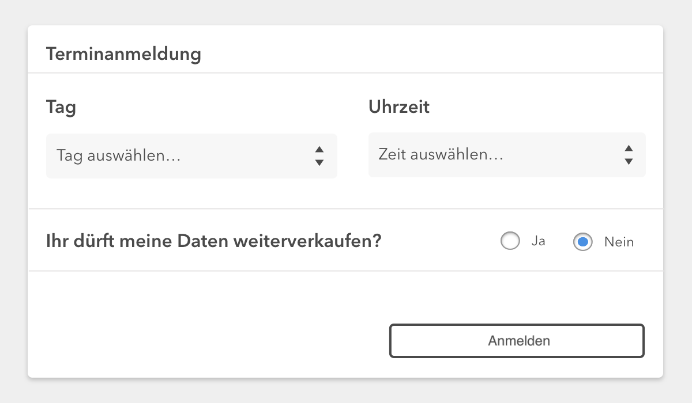

# 💻 Entwickler Praktikumsaufgabe

Hi und Willkommen bei VOLL digital!
Weil wir nichts von halben Sachen halten, haben wir eine tolle Aufgabe für dich, an der du dich beweisen kannst!

### ☝️ Darum geht es:

Unser Kunde möchte auf seiner Website ein Termin-Modul einbinden, über das sich Besucher zu einer Veranstaltung anmelden können.
Es soll **einen** Lehrgang geben, der zu unterschiedlichen Terminen an verschiedenen Tagen angeboten wird.

### 🌅 Wireframe



### 🏁 Funktionsweise/Ziel

Die beiden Dropdowns sollen in Abhängigkeit zueinander stehen. In der Tabelle unten siehst du, welche Uhrzeiten für die einzelnen Wochentage auswählbar sein können.

| Mo. & Di. | Mi.       | Do.       | Fr.       | Sa.       |
|----------:|----------:|----------:|----------:|----------:|
| 10.00 Uhr |           |  9.00 Uhr | 10.00 Uhr | 11.00 Uhr |
| 13.00 Uhr | 12.00 Uhr | 14.00 Uhr | 12.00 Uhr | 13.00 Uhr |
| 16.00 Uhr | 16.00 Uhr | 			    | 17.00 Uhr | 18.00 Uhr |
|           |           | 19.00 Uhr |           | 22.00 Uhr |

Wenn man auf "Anmelden" klickt, soll die Auswahl wie folgt ausgegeben werden (json)

```js
{
  date: Date (Natives Date-Objekt)
  time: String
  privacy: Boolean
}
```

Das Wireframe oben ist **kein** Designvorschlag, sondern bildet nur die Funktionsweise des Moduls ab.


## 🤔 Teil 1

Überlege dir eine Herangehensweise um das Modul zu erstellen.

- Was sind Dinge, die du als problematisch erkennen kannst (konzeptionell oder technisch)
- Wie gedenkst du diese zu lösen?


## 🤓 Teil 2

Technische Umsetzung mithilfe dieses Repos.


## 🔗 Nützliche Links

- [google](google.com)
- [Mozilla Developer Network](https://developer.mozilla.org/de/docs/Web)
- [Stackoverflow](https://stackoverflow.com/)
